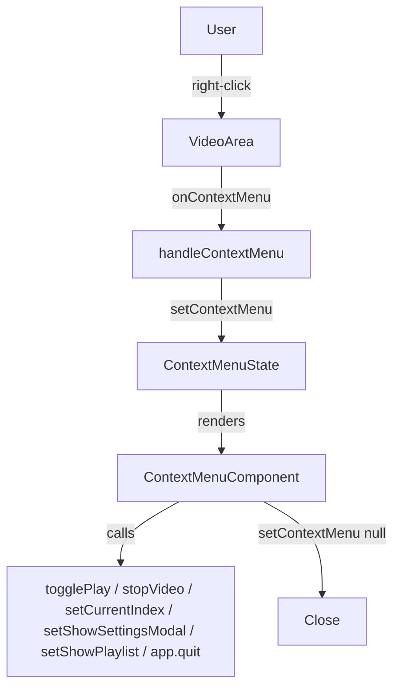

# Design Document: Context Menu Player

## Overview

This feature adds a right-click context menu to the DoggyStyle Player's video area. The menu mirrors VLC's context menu pattern — appearing at the cursor position on right-click, providing quick access to playback controls, and closing on outside click or Escape. All labels are driven by the existing `translations` object and update immediately when the user changes language.

The implementation is entirely within the React renderer (`src/App.tsx`). No Electron main-process changes are needed because Electron's `contextIsolation: false` + `nodeIntegration: true` setup already suppresses the default Chromium context menu when `onContextMenu` returns `e.preventDefault()`.

---

## Architecture

The context menu is a pure React component rendered inside `App`. It is controlled by a small piece of state (`contextMenu`) that holds the menu's visibility and screen position. The component reads existing state (`isPlaying`, `playlist`, `currentIndex`, `language`) directly from the parent scope — no new global state or context is required.



---

## Components and Interfaces

### ContextMenu component

A new file `src/ContextMenu.tsx` exports a single component:

```tsx
interface ContextMenuProps {
  x: number;
  y: number;
  isPlaying: boolean;
  hasMultipleVideos: boolean;
  t: typeof translations['en'];
  onClose: () => void;
  onPlayPause: () => void;
  onStop: () => void;
  onPrevious: () => void;
  onNext: () => void;
  onSettings: () => void;
  onPlaylist: () => void;
  onExit: () => void;
}
```

The component:
- Renders as a `fixed`-position `<ul>` at `(x, y)`.
- Clamps its position to stay within `window.innerWidth` / `window.innerHeight` after mount (via `useLayoutEffect`).
- Attaches a `mousedown` listener on `document` to detect outside clicks and call `onClose`.
- Attaches a `keydown` listener for `Escape` to call `onClose`.

### State added to App

```ts
const [contextMenu, setContextMenu] = useState<{ x: number; y: number } | null>(null);
```

### Handler added to App

```ts
const handleContextMenu = (e: React.MouseEvent) => {
  e.preventDefault();
  setContextMenu({ x: e.clientX, y: e.clientY });
};
```

This handler is attached to the video container `div` via `onContextMenu`.

### Translation keys added

Two new keys are added to both `sv` and `en` translation objects:

| Key | sv | en |
|---|---|---|
| `play` | `"Spela upp"` | `"Play"` |
| `pause` | `"Pausa"` | `"Pause"` |
| `stop` | `"Stoppa"` | `"Stop"` |
| `previous` | `"Föregående"` | `"Previous"` |
| `nextVideo` | `"Nästa Video"` | `"Next Video"` |
| `exitApp` | `"Avsluta"` | `"Exit"` |

> Note: `settings` and `playlist` keys already exist in the translations object.

---

## Data Models

### ContextMenu state

```ts
type ContextMenuState = { x: number; y: number } | null;
```

`null` means the menu is hidden. A value means it is visible at those screen coordinates.

### Menu item structure (internal to ContextMenu.tsx)

```ts
interface MenuItem {
  label: string;
  onClick: () => void;
  separator?: boolean; // renders a <hr> before this item
}
```

Items are built as a plain array inside the component render, conditionally including Previous/Next/Playlist when `hasMultipleVideos` is true.

---

## Correctness Properties

*A property is a characteristic or behavior that should hold true across all valid executions of a system — essentially, a formal statement about what the system should do. Properties serve as the bridge between human-readable specifications and machine-verifiable correctness guarantees.*

### Property 1: Context menu appears on right-click

*For any* cursor position within the player area, right-clicking should result in the context menu being visible at that position.

**Validates: Requirements 1.1**

### Property 2: Outside click closes the menu

*For any* visible context menu, a left-click outside the menu element should result in the menu no longer being visible.

**Validates: Requirements 1.2**

### Property 3: Escape key closes the menu

*For any* visible context menu, pressing the Escape key should result in the menu no longer being visible.

**Validates: Requirements 1.3**

### Property 4: Right-click repositions the menu

*For any* two distinct cursor positions, right-clicking at position A then right-clicking at position B should result in the menu being visible at position B (not A).

**Validates: Requirements 1.4**

### Property 5: Playlist items shown only for multi-video playlists

*For any* playlist of length > 1, the context menu item list should include Previous, Next Video, and Playlist. *For any* playlist of length ≤ 1, those items should be absent.

**Validates: Requirements 2.2, 2.3**

### Property 6: Play/Pause label reflects playback state

*For any* playback state, the Play/Pause menu item label should equal the pause label when playing and the play label when paused or stopped.

**Validates: Requirements 2.4, 2.5**

### Property 7: Menu item actions invoke correct handlers

*For any* context menu item click, the corresponding player action should be triggered and the menu should close.

**Validates: Requirements 3.1 – 3.8**

### Property 8: Labels match active language

*For any* language setting, all context menu item labels should equal the corresponding value in `translations[language]`.

**Validates: Requirements 4.1, 4.2, 4.3**

### Property 9: Menu stays within viewport

*For any* cursor position near the right or bottom edge of the viewport, the rendered menu should be fully within `[0, window.innerWidth] × [0, window.innerHeight]`.

**Validates: Requirements 5.3**

---

## Error Handling

- If `window.require` (Electron IPC) is unavailable when Exit is clicked (e.g., running in a browser during development), the handler should fall back gracefully — log a warning and do nothing rather than throw.
- The viewport-clamping logic in `useLayoutEffect` must guard against the case where the menu ref is null (component unmounted before layout runs).

---

## Testing Strategy

### Unit tests

Use **Vitest** + **React Testing Library**.

- Render `<ContextMenu>` with `hasMultipleVideos={false}` and assert Previous/Next/Playlist are absent.
- Render with `hasMultipleVideos={true}` and assert they are present.
- Render with `isPlaying={true}` and assert the Play/Pause item shows the pause label.
- Render with `isPlaying={false}` and assert it shows the play label.
- Render with `language='sv'` and assert Swedish labels appear.
- Render with `language='en'` and assert English labels appear.
- Simulate a click on each menu item and assert the corresponding callback was called.
- Simulate a click on each menu item and assert `onClose` was called.

### Property-based tests

Use **fast-check** (already compatible with Vitest).

Each property test runs a minimum of **100 iterations**.

Tag format: `Feature: context-menu-player, Property {N}: {property_text}`

| Property | Test description |
|---|---|
| P1 | For any `(x, y)` in `[0, 1920] × [0, 1080]`, setting `contextMenu = {x, y}` renders the menu |
| P5 | For any playlist length `n`, menu items include/exclude navigation items correctly |
| P6 | For any boolean `isPlaying`, the label matches the expected translation key |
| P8 | For any language `'sv' \| 'en'`, every rendered label equals `translations[lang][key]` |
| P9 | For any `(x, y)` near viewport edges, the clamped position keeps the menu fully in-bounds |

Each property-based test must be tagged with a comment:
```ts
// Feature: context-menu-player, Property N: <property text>
```
