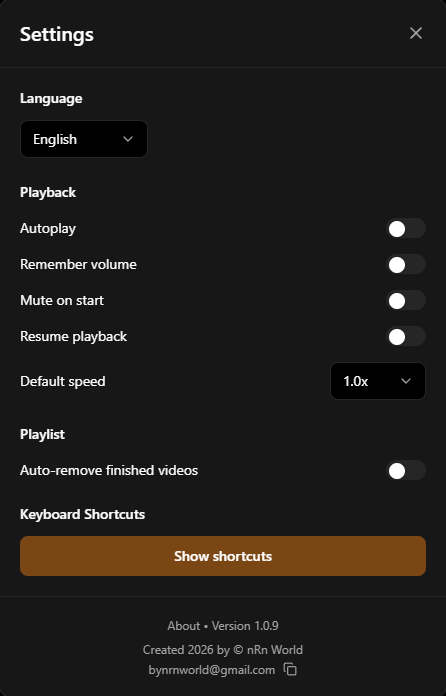

# Doggy Player


[](https://github.com/nRn-World/Doggy-Player)
[](https://www.typescriptlang.org/)
[](https://react.dev/)

---

### ⚠️ COMMERCIAL USE & LICENSING NOTICE

This project is **NOT** licensed under MIT. It is licensed under the **nRn World Non-Commercial License**.

* **Individuals & Students:** Free to download and use for
personal education and private use only. You are **PROHIBITED** from generating any income or profit from this software or its code.
* **Companies & Organizations:** You have no right to download or use this software in a professional environment without prior written consent.
* **Monetization:** Any commercial use, sale, or redistribution for profit requires a paid license.

**To purchase commercial rights, contact:** [bynrnworld@gmail.com](mailto:bynrnworld@gmail.com)

---

**Doggy Player** is a next-generation, high-performance video player built for modern users. Designed with a sleek, dark-themed interface, it offers unparalleled control over your viewing experience with unique features like intuitive mouse-wheel zooming, custom area selection, on-the-fly rotation, and seamless playlist management. As a native desktop application, it redefines how you interact with your media.

---

## 🚀 Key Features

* **🔍 Advanced Zooming & Panning**: Scroll the mouse wheel to zoom in/out smoothly. Click and drag to pan around the video.
* **🎯 Area Selection Zoom**: Hold `Shift` and draw a rectangle over the video to instantly zoom into that specific detail.
* **🔄 Instant Rotation**: Video recorded sideways? Rotate it instantly with a single click or hotkey.
* **⚡ Dynamic Speed Control**: Hold the Play button (or Spacebar) for instant slow-motion. Hold `ALT + →` to fast-forward at 1.5x speed.
* **📂 Smart Playlist**: Drag and drop multiple files. Enable "Auto-remove finished" to keep your queue clean automatically.
* **📺 IPTV Support**: Connect via Xtream Codes, M3U playlist, or activation code. Supports Live TV, Movies and Series.
* **🎬 Subtitle Support**: Load `.srt`, `.vtt`, `.ass`, `.ssa`, `.sub`, `.smi`, `.txt` files. Sync offset ±30s.
* **📸 Screenshot**: Capture any video frame with `Alt+S` or the camera button.
* **🎚️ Equalizer**: Bass, Mid, Treble ±12dB audio equalizer built into Settings.
* **📡 EPG TV Guide**: Load XML EPG data to see what's on now and next for live IPTV channels.
* **🎨 Modern Interface**: A beautiful, distraction-free dark UI with auto-hiding controls.
* **⌨️ Power-User Shortcuts**: Fully controllable via keyboard for a seamless, mouse-free workflow.

---

## 📋 Latest Update — v1.1.29

**Bug Fixes**
- `encodeForKV`/`decodeFromKV` — activation code encoding was broken
- Logout did not clear all states and localStorage keys
- Logout button called wrong function
- `autoRemoveFinished` + shuffle had wrong logic for next video
- `formatTime` did not show hours for videos longer than 60 min
- File formats in `main.js` only matched 5 formats — extended to all supported formats
- Missing translations for 6 shortcuts in the shortcuts modal
- `ContextMenu.test.tsx` was missing `isFullscreen` and `onFullscreen` in test props
- Subtitle icon was misaligned — missing `flex items-center` on wrapper div
- Logout did not clear `iptvMovies`, `iptvSeries`, categories, search state

**New Features**
- Subtitle support — `.srt`, `.vtt`, `.ass`, `.ssa`, `.sub`, `.smi`, `.txt`
- Subtitle sync offset ±30s with slider and buttons
- IPTV login restructured — Code / Xtream / M3U with sub-categories Playlist and Stream URL
- Stream URL field for direct links to `.m3u8`, `.mp4` etc.
- HLS quality selector in controls bar (Auto + manual)
- IPTV default quality setting in Settings
- Persistent login — stays logged in after restart and updates
- Screenshot with `Alt+S` and camera button
- Equalizer — Bass, Mid, Treble ±12dB (moved to Settings)
- EPG TV guide — load XML, shows Now/Next per channel
- EPG program name shown directly on channel cards in grid
- Settings modal now scrollable with ESC to close
- Settings icon in sidebar removed (only in controls bar)
- File open via "Open with" now supports all video formats

---

## 🏆 Why Choose Doggy Player?

Here is how Doggy Player compares to traditional media players:

| Feature | Doggy Player | Traditional Players (e.g., VLC) |
| :--- | :--- | :--- |
| **Modern UI** | ✅ Sleek, dark, and highly intuitive | ⚠️ Often dated and cluttered |
| **Area Selection Zoom** | ✅ **Unique!** Draw a box to zoom instantly | ❌ Missing entirely |
| **Mouse-Wheel Zoom** | ✅ Smooth, instant, and natural | ❌ Clunky or requires deep menu digging |
| **Video Rotation** | ✅ Instant via UI button or hotkey (`R`) | ⚠️ Requires navigating complex video filter settings |
| **Quick Slow-Mo** | ✅ Hold Play/Spacebar to temporarily slow down | ❌ Requires changing global speed settings |
| **Quick Fast-Forward** | ✅ Hold `ALT + →` for instant 1.5x speed | ⚠️ Different/Clunky implementation |
| **Playlist Management** | ✅ Auto-removes finished videos (optional) | ❌ Manual removal required |
| **Touch Support** | ✅ Excellent, responsive touch controls | ⚠️ Limited or not optimized for touch |

---

## 📸 Screenshots

<p align="center">
  <a href="Screenshot/Sc1.png">
    
  </a>
  <a href="Screenshot/Sc2.png">
    
  </a>
  <a href="Screenshot/Sc3.png">
    
  </a>
</p>

<p align="center">
  <em>Main Interface</em> &nbsp;&nbsp;•&nbsp;&nbsp; <em>Playback High-Quality</em> &nbsp;&nbsp;•&nbsp;&nbsp; <em>Minimalist Design</em>
</p>

---

## 📥 Download & Installation

### Option 1: Windows Desktop App (Electron)

1. Go to the [**Releases**](https://github.com/nRn-World/Doggy-Player/releases) page.
2. Download the latest Windows installer (`Doggy-Player-Setup.exe`) or portable version.
3. Run the application. You can set it as your default video player in Windows!

### Option 2: Build from Source (For Developers)

1. Clone the repository:
    ```bash
    git clone https://github.com/nRn-World/Doggy-Player.git
    ```
2. Navigate to the directory and install dependencies:
    ```bash
    cd Doggy-Player
    npm install
    ```
3. Start the development server:
    ```bash
    npm run dev
    ```

---

## 📖 How to Use

1. **Add Videos**: Drag and drop any supported video file (`.mp4`, `.mkv`, `.avi`, etc.) directly into the player.
2. **Zoom & Pan**: Scroll the mouse wheel to zoom in/out. Click and drag to pan around the zoomed video.
3. **Area Zoom**: Hold `Shift`, click, and drag a box over the video to instantly zoom into that specific area.
4. **Quick Slow-Mo**: Click and hold the Play/Pause button to temporarily slow down the video. Release to resume normal speed.
5. **Rotate**: Click the rotate icon in the control bar to fix sideways videos instantly.

---

## 🛠️ Tech Stack

* **Language**: TypeScript
* **Frontend**: React 19, Vite
* **Styling**: Tailwind CSS
* **Icons**: Lucide React
* **Desktop Wrapper**: Electron

---

## 🤝 Contributing

Educational contributions are welcome! 

1. Fork the repository.
2. Create your feature branch (`git checkout -b feature/AmazingFeature`).
3. Commit your changes.
4. Push to the branch.
5. Open a Pull Request.

---

## 📄 License

**ALL Copyright (c) 2026 nRn World**

This project is licensed under a strict **Non-Commercial License**. Commercial use, redistribution for profit, or use by companies is prohibited without a purchased license. See the [LICENSE](LICENSE) file for the full legal text.

---

👨‍💻 **Author:** **nRn World**  
📧 **Contact:** [bynrnworld@gmail.com](mailto:bynrnworld@gmail.com)

## 🙏 Support

If you like this project, consider:
* ⭐ Star the project on GitHub
* ☕ [Buy me a coffee](https://buymeacoffee.com/nrnworld)
* 📢 Share it with your friends
